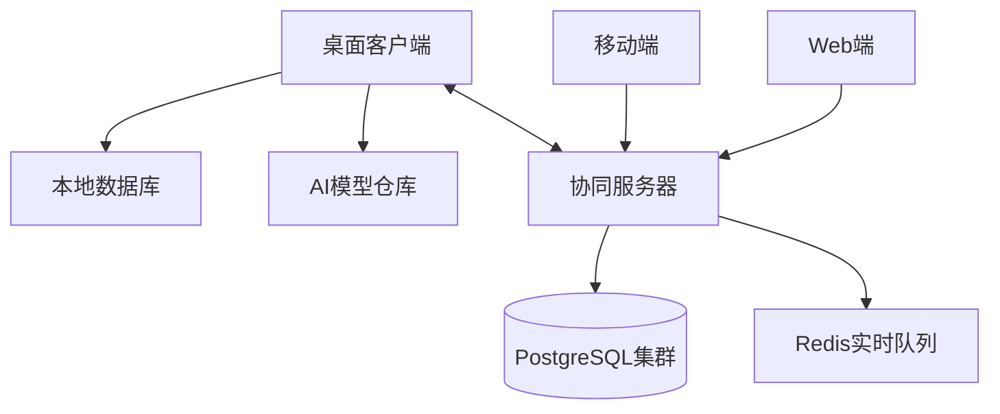

故事大概就是我突然想做一个todo类软件，在我和deepseek切磋了创新点，功能点等之后，deepseek给出了如下不明觉厉的项目规划说明书

### **智能任务协同管理平台需求规格说明书**  

**文档编号**：TDMS-RS-2025-v1.2  
**发布日期**：2025年7月15日  

---

### **1. 系统概述**  

开发基于Qt/C++与SQLite/PostgreSQL的跨平台任务管理系统，集成AI增强能力，支持个人至团队级任务管理，实现**任务规划→执行监控→知识沉淀→智能进化**的全生命周期管理。

---

### **2. 功能需求**  

#### **2.1 核心任务管理模块**  

| 功能编号 | 需求描述                          | 技术实现要点                   |
| -------- | --------------------------------- | ------------------------------ |
| TD-0100  | **多视图任务展示**                | QTabWidget + QStackedWidget    |
|          | - 看板视图（Kanban）              | QGraphicsView拖拽泳道          |
|          | - 时间线视图（Gantt）             | QCustomPlot动态图表            |
|          | - 列表视图/树状视图               | QTreeView + QStandardItemModel |
| TD-0200  | **任务元素管理**                  | 数据库关系设计                 |
|          | - 任务属性：标题/描述/优先级/标签 | SQLite BLOB存储富文本          |
|          | - 子任务分解（无限层级）          | 邻接表结构存储                 |
|          | - 附件管理（文档/图片/链接）      | QFileSystemWatcher监控目录     |
| TD-0300  | **智能提醒系统**                  | QCalendarWidget集成            |
|          | - 时间提醒（绝对/相对时间）       | 基于cron表达式解析器           |
|          | - 位置提醒（GPS触发）             | QtPositioning模块              |
|          | - 设备状态提醒（空闲时推送）      | QSystemIdleDetector            |

#### **2.2 协同工作模块**  

| 功能编号 | 需求描述                               | 技术实现要点                      |
| -------- | -------------------------------------- | --------------------------------- |
| CL-0100  | **团队空间管理**                       | OAuth2.0认证体系                  |
|          | - 角色权限控制（所有者/编辑者/查看者） | RBAC模型数据库设计                |
|          | - 项目空间隔离                         | SQLite ATTACH DATABASE            |
| CL-0200  | **实时协作功能**                       | WebSocket + Operational Transform |
|          | - 任务分配与@提及通知                  | QNetworkSession管理连接           |
|          | - 协同编辑冲突解决                     | CRDT算法实现                      |
|          | - 版本历史追溯（可回滚）               | SQLite时间旅行扩展                |
| CL-0300  | **沟通集成**                           | libcurl网络库                     |
|          | - 评论线程（Markdown支持）             | QTextDocument解析                 |
|          | - 邮件同步（任务变更通知）             | SMTP协议实现                      |

#### **2.3 AI增强模块**  

| 功能编号 | 需求描述                        | 技术实现要点            |
| -------- | ------------------------------- | ----------------------- |
| AI-0100  | **自然语言任务解析**            | ONNX运行时本地推理      |
|          | - 任务语义解构（提取实体/关系） | 微调BERT模型（<50MB）   |
|          | - 自动生成子任务树              | 决策树算法生成          |
| AI-0200  | **动态规划引擎**                | QtConcurrent并行计算    |
|          | - 时间预估（基于历史效率分析）  | ARIMA时间序列预测       |
|          | - 智能排程（资源冲突检测）      | 约束满足问题求解器      |
|          | - 风险预警（关键路径标识）      | 图论算法应用            |
| AI-0300  | **知识增强系统**                | DuckDB向量数据库        |
|          | - 任务关联文档推荐              | Sentence-BERT相似度匹配 |
|          | - 代码片段自动生成（开发任务）  | OpenAI Codex本地化模型  |

#### **2.4 分析预测模块**  

| 功能编号 | 需求描述                         | 技术实现要点       |
| -------- | -------------------------------- | ------------------ |
| AN-0100  | **生产力分析**                   | QtCharts数据可视化 |
|          | - 个人效能热力图（专注时段分析） | QSensor数据采集    |
|          | - 团队负载均衡图                 | 力导向图算法       |
| AN-0200  | **预测性报告**                   | SQL窗口函数分析    |
|          | - 项目完成概率预测               | 蒙特卡洛模拟       |
|          | - 延期风险指数计算               | 逻辑回归模型       |

---

### **3. 非功能性需求**  

#### **3.1 性能需求**  

```mermaid
gantt
    title 关键性能指标
    dateFormat  YYYY-MM-DD
    section 响应时间
    任务加载(1000条)   ：active, p1, 2025-08-01, 1.2s
    AI解析响应(P95)    ：         p2, after p1, 0.8s 
    协同操作同步       ：         p3, after p2, 0.3s
    
    section 资源占用
    内存常驻          ：crit, 2025-08-01, 120MB
    存储压缩比        ：         >=5:1
```

#### **3.2 安全需求**  

- **数据加密**：SQLite页级AES-256加密（SQLCipher扩展）
- **隐私保护**：AI处理本地化（可选关闭云同步）
- **审计追踪**：操作日志HMAC-SHA256签名

#### **3.3 可靠性需求**  

- **崩溃恢复**：自动保存点（15分钟增量备份）
- **冲突解决**：三阶段协同冲突处理策略：
  1. 客户端自动合并（基于CRDT）
  2. 用户决策界面（可视化差异对比）
  3. 版本分支存档

#### **3.4 兼容性需求**  

| 平台    | 支持级别        | 技术方案          |
| ------- | --------------- | ----------------- |
| Windows | 完整功能        | MSVC 2022编译     |
| macOS   | 完整功能+原生UI | Qt for macOS      |
| Linux   | 完整功能        | Wayland/X11双支持 |
| Android | 核心功能        | Qt 6.5 Mobile模块 |
| Web     | 只读视图        | WebAssembly编译   |

---

### **4. 系统架构**  

#### **4.1 逻辑架构**  

```plaintext
+-----------------------+
|     Presentation      |
|  QWidgets / QtQuick   |
+----------+------------+
           | (信号槽)
+----------v------------+
|    Business Logic     |
|  - 任务管理核心       |
|  - AI推理引擎         |
|  - 协同控制器         |
+----------+------------+
           | (DAO接口)
+----------v------------+
|       Data Layer      |
|  - SQLite OLTP        |
|  - DuckDB OLAP        |
|  - 模型文件存储       |
+-----------------------+
```

#### **4.2 部署架构**  



---

### **5. AI集成方案**  

#### **5.1 智能规划工作流**  

```mermaid
sequenceDiagram
    participant User
    participant UI
    participant AI Engine
    participant Database
    
    User->>UI： 输入“开发邮件客户端，需加密模块，两周完成”
    UI->>AI Engine： 发送自然语言请求
    AI Engine->>AI Engine： 实体识别（技术栈/时间/功能）
    AI Engine->>Database： 查询相似任务历史数据
    Database-->>AI Engine： 返回历史执行指标
    AI Engine->>AI Engine： 生成任务分解树
    AI Engine->>UI： 返回结构化规划：
        • 子任务：UI框架/认证模块/加密集成
        • 时间线：甘特图+风险提示
    UI->>User： 可视化展示可编辑方案
```

#### **5.2 关键技术实现**  

```cpp
// AI任务解析核心类
class TaskParser : public QObject {
    Q_OBJECT
public:
    explicit TaskParser(QObject *parent = nullptr);
    
    Q_INVOKABLE ParsedTask parseDescription(const QString &text);
    
private:
    // ONNX推理引擎
    Ort::Session *nlpSession; 
    
    // 本地知识图谱
    DuckDBConnection *knowledgeGraph;
};

// 返回数据结构
struct ParsedTask {
    QString title;
    QVector<Subtask> subtasks;
    QMap<QString, QTime> timeEstimates;
    QVector<KnowledgeLink> relatedResources;
};
```

---

### **6. 交付物规划**  

#### **6.1 阶段化交付**  

| 迭代 | 功能集                  | AI能力           | 周期 |
| ---- | ----------------------- | ---------------- | ---- |
| MVP  | 基础任务管理+本地AI解析 | L1：关键词提取   | 8周  |
| v1.0 | 团队协同+动态规划       | L2：时间预估     | 12周 |
| v1.5 | 预测分析+跨平台         | L3：风险建模     | 6周  |
| v2.0 | AR集成+企业级扩展       | L4：自适应工作流 | 10周 |

#### **6.2 质量保障**  

- **自动化测试覆盖率**：
  - 核心逻辑：≥85%（QTest框架）
  - UI交互：≥70%（Squish自动化）
- **AI模型评估**：
  - 任务分解准确率：F1-score ≥0.82
  - 时间预估误差：MAPE ≤15%

---

### **7. 创新价值矩阵**  

```mermaid
quadrantChart
    title 功能价值分析
    x-axis 开发成本 →
    y-axis 用户价值 ↑
    quadrant-1 战略核心
    quadrant-2 差异化优势
    quadrant-3 基础必备
    quadrant-4 优化选项
    “动态AI规划”： [0.7, 0.95]
    “协同冲突解决”： [0.6, 0.8]
    “多视图看板”： [0.3, 0.9]
    “知识图谱”： [0.65, 0.7]
    “AR集成”： [0.85, 0.6]
```

---

本需求书完整涵盖传统任务管理核心功能（看板/协同/提醒）与AI创新点（智能规划/预测分析），建议采用**模块化开发策略**：  

1. **基础框架搭建**：实现TD-0100/TD-0200模块（4周）  
2. **协同核心开发**：完成CL系列功能（6周）  
3. **AI引擎集成**：部署AI-0100/AI-0200（8周）  
4. **分析预测扩展**：构建AN模块（4周）  

具体内容我觉得非常好，所以打算朝这个方向做，虽然很明显我做不成很厉害的样子但至少可以做着玩玩。

## 起手
我肯定不愿意用qt原生的组件，因为太丑，自己搓组件又太麻烦，所以我干脆上网找开源项目。有一个QFluentWidget的项目，但是它的cpp的版本要几千块钱买，所以我只好放弃。后面找到了ElaWidgetTools，今天下午刚配好ElaWidgetTools，预计后面以ElaWidgetTools作为主要UI库。
目前项目刚刚开始，希望我不要又做成一坨。
